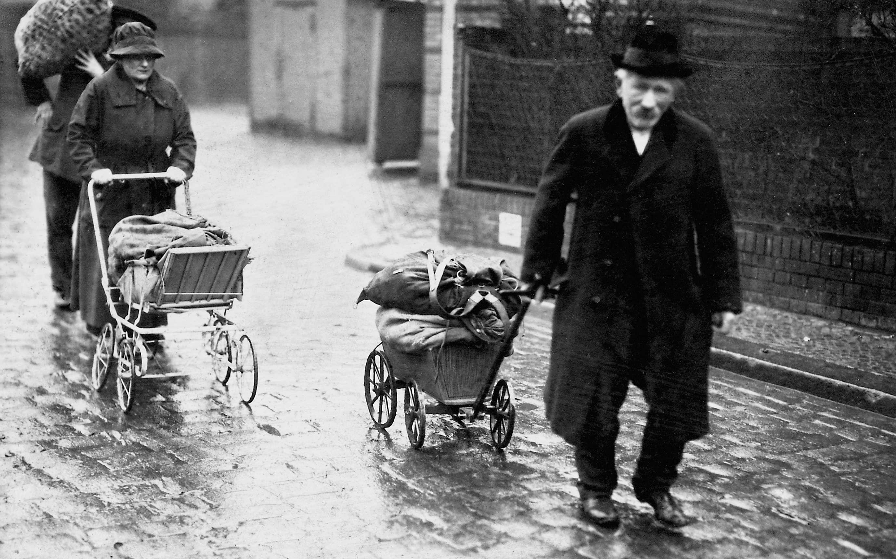

# Weimarer Republik

* Die Republik nach dem  1. WK in Deutschland- wurde in Weimar ausgerufen
* 1919 (Wilhelm dankt ab- Ende der Monarchie bis 1933 - Machtergreifung Hitlers)
* Eine Zeit mit vielen unterschiedlichen Denkrichtungen (Monarchisten, Nationalisten, Kommunisten, Sozialisten, Sozialdemokraten, Konservativen, Liberale, ...)
* Demokratie :arrow_forward: demokratische Republik :arrow_forward: Bundestag (Parlament), viele kleine Parteien :arrow_forward: Meinungsspaltung, jeder gegen jeden-Prinzip, schwache und instabile Koalitionen :arrow_forward: da Demokratie neu ist und gleich so problembehaftet, ist sie teilweise sehr unbeliebt
* Wesentliche Probleme der Demokratie neben Parteienvielfalt: 
  * Demokratisches System verfährt langsam
  * Wirtschaflicher Zusammenbruch nach dem 1. WK :arrow_forward: Hyperinflation​
  * Reparationszahlungen, Verschuldung
  * Frust über Versailler Vertrag

**Kampf dagegen**

- **Stopp der Geldmenge:** Zentralbank beendet Finanzierung des Staates.
- **Sparzwang:** Drastische Kürzung der Staatsausgaben.
- **Zinserhöhung:** Geld wird extrem teuer und knapp.

**Währungsreform**

- **Neustart:** Alte Währung wird wertlos; Einführung einer neuen Währung.
- **Nullenstreichung:** Umrechnungskurs (z.B. 1 Bio. : 1) vereinfacht Zahlen.
- **Glaubwürdigkeit:** Neue Währung braucht Deckung (Gold/Devisen), um Vertrauen zu sichern.

| Jahr / Zeitpunkt | Preis                                             |
| ---------------- | ------------------------------------------------- |
| **1917**         | ca. **0,68 Mark**                                 |
| **1919**         | ca. **1,20 Mark**                                 |
| **1922**         | ca. **3–5 Mark** (starker Anstieg beginnt)        |
| **1923 Jänner**  | ca. **250 Mark**                                  |
| **1923 Herbst**  | ca. **200 Milliarden Mark** (regional auch höher) |
| **1927**         | ca. **0,40–0,50 Reichsmark** (wieder stabil)      |

**Hyperinflation**

|  |  |
| ------------------------------------------------------------ | ------------------------------------------------------------ |

---

* Große Probleme der 20er: hohe Arbeitslosigkeit, Armut, Hunger, es fehlt an Grundbedürfnisbefriedigung: Unzufriedenheit in der bevölkerung - Suche nach Schuldigen!! Extreme Meinungen bilden sich!
* Die 20er bestanden einerseits aus wirtschaftlichem Zusammenbruch, Arbeitslosigkeit und folgen davon, andererseits aus den GOLDENEN 20er
  * **Musik:** Jazz
  * **Tanz:** Charleston
  * **Mode:** Der Bubikopf (Kurzhaarschnitt)
  * **Gefühle:** Lebensrausch (auf dem Vulkan)
  * **Neue Freiheiten:** Das Frauenwahlrecht
  * **Lebensstil:** Urbanisierung (Großstadtleben)
  * **Für wen?** Die städtische Elite
* 