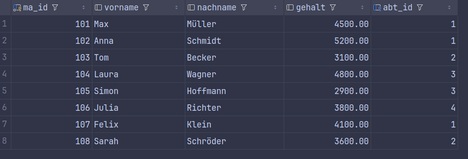
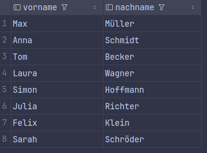
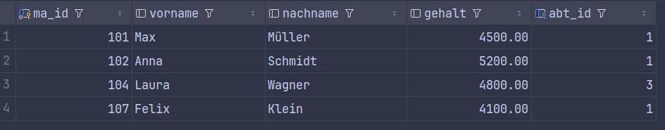
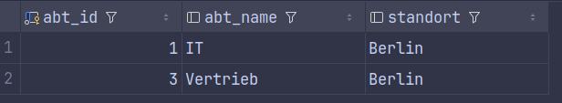
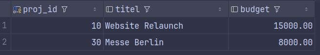

# Aufgabenstellungen 

## Einfache SELECTs & WHERE-Bedingungen
* Zeige alle Spalten aus der Tabelle mitarbeiter an.

  

* Zeige nur den Vor- und Nachnamen aller Mitarbeiter an.

  

* Finde alle Mitarbeiter, die ein Gehalt von mehr als 4000 verdienen.

  

* Zeige alle Abteilungen an, die ihren Standort in 'Berlin' haben.

  

* Finde alle Projekte, deren Budget zwischen 5000 und 20000 liegt.

  

## JOINS 
* Zeige den Vor- und Nachnamen aller Mitarbeiter sowie den Namen ihrer Abteilung an.

  

* Welche Mitarbeiter (Vorname, Nachname) arbeiten am Standort 'München'?

* Zeige alle Abteilungen und deren Mitarbeiter an. Auch Abteilungen ohne Mitarbeiter sollen in der Liste erscheinen .

* Liste alle Mitarbeiter auf, die am Projekt mit der ID 10 arbeiten (Zeige Vorname, Nachname und die investierten Stunden).

* Zeige den Projekttitel, den Nachnamen des Mitarbeiters und die Stunden für alle Projektzuordnungen an.

## GROUP BY & Aggregatfunktionen
* Wie viele Mitarbeiter arbeiten in der gesamten Firma? .
* Ermittle das durchschnittliche Gehalt aller Mitarbeiter .
* Zähle, wie viele Mitarbeiter in jeder Abteilung arbeiten. Zeige die Abteilungs-ID und die Anzahl an .
* Berechne das durchschnittliche Gehalt pro Abteilung (Zeige Abteilungs-ID und Durchschnittsgehalt).
* Wie viele Stunden wurden insgesamt für das Projekt mit der ID 20 aufgewendet?

## Kombinationen (JOIN + WHERE + GROUP BY + HAVING)
* Zeige den Namen jeder Abteilung und die Anzahl der dortigen Mitarbeiter an.
* Welche Abteilungen haben mehr als 2 Mitarbeiter?
* Berechne die Gesamtsumme der investierten Stunden pro Projekttitel.
* Zeige das durchschnittliche Gehalt pro Abteilung an (mit Abteilungsnamen), aber berücksichtige für den Durchschnitt nur Mitarbeiter, die mehr als 3000 verdienen.
* Finde heraus, an wie vielen verschiedenen Projekten jeder Mitarbeiter arbeitet. Zeige den Nachnamen des Mitarbeiters und die Anzahl seiner Projekte, sortiert nach der höchsten Projektanzahl.