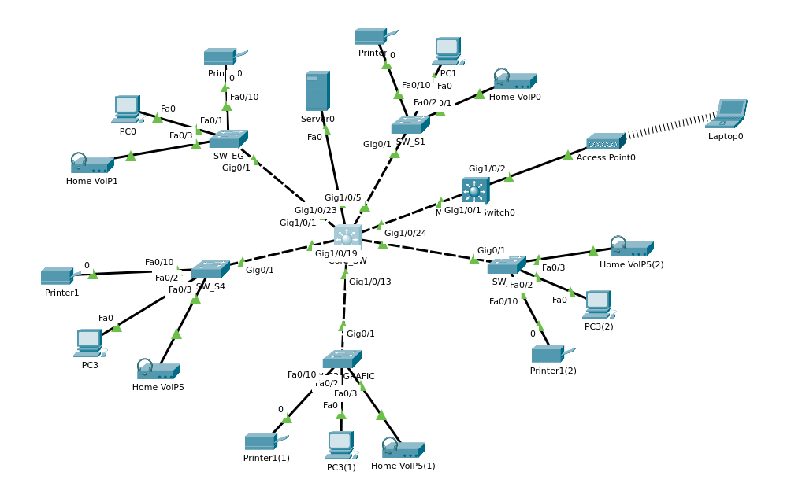
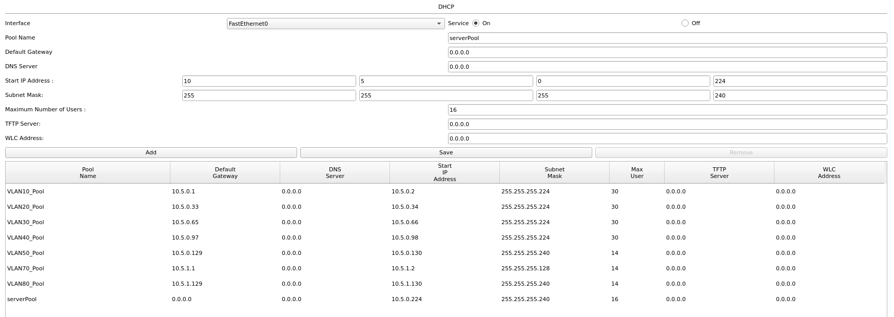
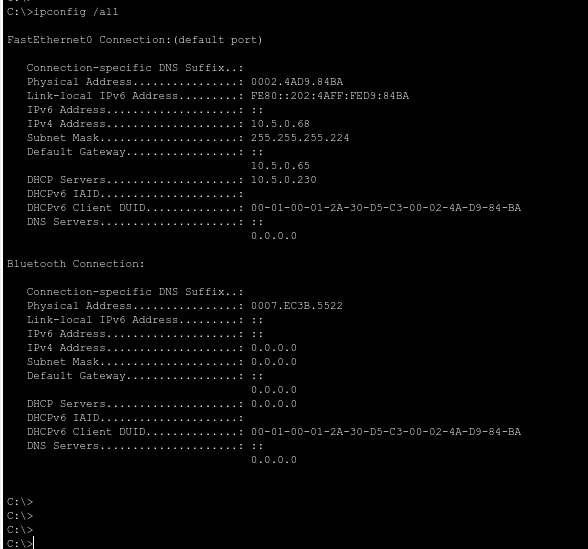

# Projekt: Netzwerk „Grüne Wiese“ Dokumentation

**Klasse:** 3ABHITS

**Name:** Adrian Fritz

**Katalognummer:** 5

**Datum:** 09.03.2026

------

## 1. Ausgangslage & IP-Konzept

Für das Projekt wurde eine Netzwerk-Infrastruktur entworfen, die auf einer VLAN-Trennung basiert. Gemäß der Vorgabe wurde das Netz **10.5.0.0/23** (Katalognummer 5) verwendet.

### IP-Adressen-Tabelle

| **VLAN** | **Name**         | **Netz-IP** | **Gateway** | **Maske**       | **CIDR** |
| -------- | ---------------- | ----------- | ----------- | --------------- | -------- |
| 10       | Stock_E          | 10.5.0.0    | 10.5.0.1    | 255.255.255.224 | /27      |
| 20       | Stock_1          | 10.5.0.32   | 10.5.0.33   | 255.255.255.224 | /27      |
| 30       | Stock_2          | 10.5.0.64   | 10.5.0.65   | 255.255.255.224 | /27      |
| 40       | Grafik (Stock_3) | 10.5.0.96   | 10.5.0.97   | 255.255.255.224 | /27      |
| 50       | Stock_4          | 10.5.0.128  | 10.5.0.129  | 255.255.255.240 | /28      |
| 70       | VoIP             | 10.5.1.0    | 10.5.1.1    | 255.255.255.128 | /25      |
| 80       | Drucker          | 10.5.1.128  | 10.5.1.129  | 255.255.255.240 | /28      |
| 99       | Management       | 10.5.0.224  | 10.5.0.225  | 255.255.255.240 | /28      |

------

## 2. Netzwerk-Topologie

Das Netzwerk wurde in einer Stern-Topologie mit einem zentralen Layer-3-Switch (Core-SW 3650) und mehreren Access-Switches (2960) aufgebaut.



------

## 3. DHCP-Konfiguration

Ein zentraler DHCP-Server im Management-VLAN (IP: 10.5.0.230) versorgt alle Endgeräte mit IP-Adressen. Auf dem Core-Switch wurde dafür ein Relay-Agent (IP-Helper) konfiguriert.

### DHCP-Pools am Server

- **Pool VLAN10:** GW 10.5.0.1, Start 10.5.0.2, Maske .224
- **Pool VLAN20:** GW 10.5.0.33, Start 10.5.0.34, Maske .224
- **Pool VLAN30:** GW 10.5.0.65, Start 10.5.0.66, Maske .224
- **Pool VLAN40:** GW 10.5.0.97, Start 10.5.0.98, Maske .224
- **Pool VLAN50:** GW 10.5.0.129, Start 10.5.0.130, Maske .240
- **Pool VLAN70:** GW 10.5.1.1, Start 10.5.1.2, Maske .128
- **Pool VLAN80:** GW 10.5.1.129, Start 10.5.1.130, Maske .240



------

## 4. CLI-Konfiguration (Auszug Core-Switch)

Die Konfiguration der SVI (Switched Virtual Interfaces) und der Helper-Adressen auf dem Core-Switch:

Bash

```
enable
configure terminal
hostname Core-SW
ip routing  # Aktiviert Layer-3 Routing

# VLAN-Erstellung
vlan 10,20,30,40,50,70,80,99
exit

# SVI Konfiguration & DHCP Relay
interface Vlan10
 ip address 10.5.0.1 255.255.255.224
 ip helper-address 10.5.0.230
!
interface Vlan20
 ip address 10.5.0.33 255.255.255.224
 ip helper-address 10.5.0.230
!
interface Vlan30
 ip address 10.5.0.65 255.255.255.224
 ip helper-address 10.5.0.230
!
interface Vlan40
 ip address 10.5.0.97 255.255.255.224
 ip helper-address 10.5.0.230
!
interface Vlan50
 ip address 10.5.0.129 255.255.255.240
 ip helper-address 10.5.0.230
!
interface Vlan70
 ip address 10.5.1.1 255.255.255.128
 ip helper-address 10.5.0.230
!
interface Vlan80
 ip address 10.5.1.129 255.255.255.240
 ip helper-address 10.5.0.230
!
interface Vlan99
 ip address 10.5.0.225 255.255.255.240

# Trunk-Konfiguration zu den Access-Switches
interface range GigabitEthernet1/0/1 - 5
 switchport trunk encapsulation dot1q
 switchport mode trunk

# Anbindung DHCP-Server
interface GigabitEthernet1/0/23
 switchport mode access
 switchport access vlan 99
 spanning-tree portfast
```

------

## 5. Funktionsprüfung (Beweise)

Die erfolgreiche Zuweisung der IP-Adressen wurde mittels `ipconfig /all` an den Endgeräten getestet.



------

