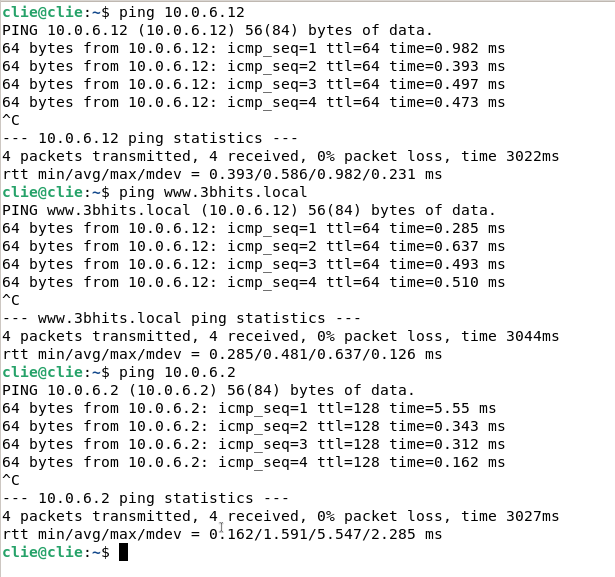
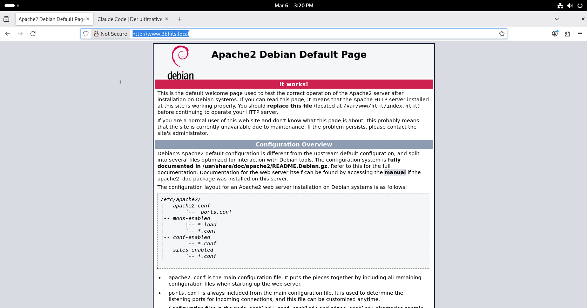
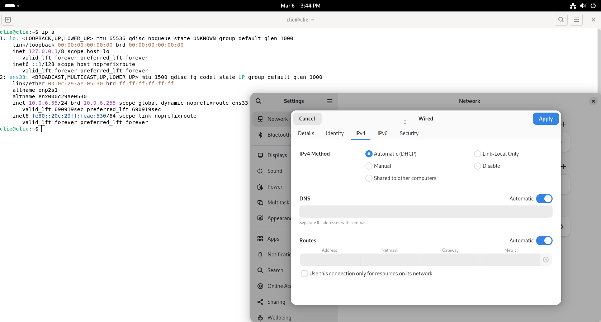

# Arbeitsauftrag Freitag 06.03.2026 

# Dokumentation

## 1. & 3.

```powershell
PS C:\Users\Administrator> Get-DnsServerResourceRecord 3bhits.local

HostName                  RecordType Type       Timestamp            TimeToLive      RecordData
--------                  ---------- ----       ---------            ----------      ----------
@                         NS         2          0                    01:00:00        win-eerp8aq2itt.
@                         SOA        6          0                    01:00:00        [3][win-eerp8aq2itt.][hostmaster.]
3bhits.local              NS         2          0                    01:00:00        win-eerp8aq2itt.
3bhits.local              SOA        6          0                    01:00:00        [3][win-eerp8aq2itt.][hostmaster.]
ns1.3bhits.local.3bhit... A          1          0                    01:00:00        10.0.6.10
www.3bhits.local          A          1          0                    01:00:00        10.0.6.12
www                       A          1          0                    01:00:00        10.0.6.12


PS C:\Users\Administrator>
```

```powershell
PS C:\Users\Administrator> Get-DhcpServerv4OptionValue -ScopeId 10.0.6.0

OptionId   Name            Type       Value                VendorClass     UserClass       PolicyName
--------   ----            ----       -----                -----------     ---------       ----------
51         Lease           DWord      {691200}
3          Router          IPv4Add... {10.0.6.2}
6          DNS-Server      IPv4Add... {8.8.8.8}


PS C:\Users\Administrator>
```

## 2. 



## 4. 

```powershell
PS C:\Users\Administrator> Get-DhcpServerv4Reservation -Scopeid 10.0.6.10

IPAddress            ScopeId              ClientId             Name                 Type                 Description
---------            -------              --------             ----                 ----                 -----------
10.0.6.12            10.0.6.10            29-66-17-84-00-01... debweb               Both


PS C:\Users\Administrator>
```

## 5. 




## 6. 

### DHCP

* Statische IPv4 Address

  ``````powershell
  New-NetIPAddress -IPAddress 10.0.6.10 -InterfaceAlias "Ethernet0" -DefaultGateway 10.0.6.2 -AddressFamily ipv4 -Prefixlength 24
  ``````

* ```powershell
  Set-DnsClientServerAddress -InterfaceAlias "Ethernet0" -ServerAddresses "8.8.8.8", "8.8.4.4"
  ```

* **DHCP-Server installieren**

  ```powershell
  Install-WindowsFeature -Name DHCP -IncludeManagementTools
  ```

* Pool erstellen: 

  ```powershell
  Add-DhcpServerv4Scope -Name frit -StartRange 10.0.6.55 -EndRange 10.0.6.155 -SubnetMask 255.255.255.0 -State Active
  Get-DhcpServerv4Scope
  ```

* DNS-Server setzen `-Optionid 6`

  ```powershell
  Set-DhcpServerv4OptionValue -Scopeid 10.0.6.0 -Optionid 6 -Value "8.8.8.8"
  Get-DhcpServerv4OptionValue -Scopeid 10.0.6.0
  ```

* Default-gateway setzen `-Optionid 3`

  ```powershell
  Set-DhcpServerv4OptionValue -Scopeid 10.0.6.0 -Optionid 3 -Value "10.0.6.2"
  Get-DhcpServerv4OptionValue -Scopeid 10.0.6.0 # kontrollieren
  ```

* Reservations

  ```powershell
  Get-DhcpServerv4Lease -Scopeid 10.0.6.0
  Add-DhcpServerv4Reservation -Scopeid 10.0.6.0 -Clientid (Get-DhcpServerv4Lease -Scopeid 10.0.6.0).Clientid -IPAddress 10.0.6.12 -Name "DWC" # Debien Webserver Client
  ```


### DNS

* ```powershell
  Install-WindowsFeature DNS -IncludeManagementTools
  ```

* ```powershell
  Add-DnsServerPrimaryZone -Name "3bhits.local" -ZoneFile "3bhits.local"
  ```

* ```powershell
  Set-DnsServerForwarder -IPAddress "8.8.4.4"
  Add-DnsServerForwarder -IPAddress "8.8.8.8"
  Get-DnsServerForwarder
  ```

* ```powershell
  Add-DnsServerResourceRecordA -IPv4Address 10.0.6.10 -Name ns1.3bhits.local -ZoneName 3bhits.local
  ```

* ```powershell
  Set-DnsClientServerAddress -InterfaceAlias Ethernet0 -ServerAddresses "10.0.6.10"
  ```

* ```powershell
  Set-DhcpServerv4OptionValue -Scopeid 10.0.6.0 -DnsServer 10.0.6.10
  Get-DhcpServerv4OptionValue -Scopeid 10.0.6.0
  ```

* ```powershell
  Get-DnsServerZone
  ```

* ```powershell
  Get-DnsServerResourceRecord 3bhits.local
  ```

* ```powershell
  Add-DnsServerResourceRecordA -ZoneName 3bhits.local -Name "www" -IPv4Address "10.0.6.12"
  ```

* ```powershell
  Set-DhcpServerv4OptionValue -ScopeId 10.0.6.0 -OptionId 6 -Value 10.0.6.10
  ```


## 7. 

