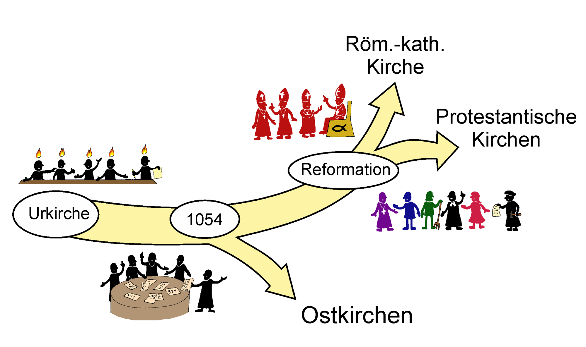

# Februar

## Kirchengeschichte

**Ab 0-100 Urchristentum**

**Alte Kirche**

* Ablasshandel
* Christenverfolgung (Kaiser Nero)

**Mittelalter**

* Kreuzzüge
* Kirchenspaltung Orthodoxe Kirche

**1500 Reformation**

* Martin Luther / Kirchenspaltung (evangelisch)
* Übersetzung der Bibel
* Buchdruck

**Ab 1900 Neuzeit**

**Gegenwart**

* Missbrauchsskandale / Gegenwirkung
* Papst Johannes Paul
* Päpste

## Bild erklärung

**Urkirche:** Die gemeinsame christliche Wurzel beginnt mit der Zeit der Apostel und der frühen Gemeinschaft der Gläubigen.

**Schisma von 1054:** Die erste große Spaltung trennt die Kirche in die westliche römisch-katholische Tradition und die östlich-orthodoxen Kirchen (**Ostkirchen**).

**Reformation:** Im 16. Jahrhundert führt eine religiöse Erneuerungsbewegung zu einer weiteren Verzweigung innerhalb der westlichen Kirche.

**Römisch-katholische Kirche:** Aus der Reformation geht die katholische Kirche als ein eigenständiger Zweig mit ihrer traditionellen Hierarchie hervor.

**Protestantische Kirchen:** Als Resultat der Reformation entstehen die evangelischen Glaubensgemeinschaften, die sich vom Papsttum ablösen.

## [2_Kirchengeschichte_Überblick.pdf](2_Kirchengeschichte_Überblick.pdf)

* 395 n. Chr.: zerfall des Römischen Imperiums in einen westlichen/östlichen Teil
* seit 4. Jhdt.: Pilgerreisen nach Jerusalem für Christen wichtig
* 632 n. Chr.: Islam hat sich rasant über den vorderen Orient ausgebreitet (nach dem Tod des Propheten Mohammed)
* 1009: Zerstörung Grabeskirche
* 1054: Kirchenspaltung röm.-kath. / orthodox
* 11. Jhdt.: Einfall Selschuken / muslimisches Heer

**Hilferuf nach Rom -> Kreuzzüge**

* (1493: Eroberung Konstantinopel durch Osmanen)
